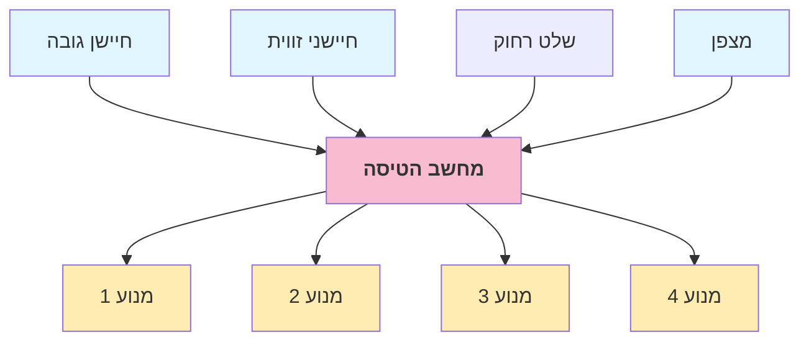

  
    גרא וייס 
    המחלקה למדעי המחשב  
    אוניברסיטת בן גוריון
  

  <h1 style="color:rgb(238, 234, 209);">איך פועל רובוט מעופף?</h1>
  <h2>פתרון משוואות בשמיים</h2>

---

# האם זה רובוט?

  <iframe
    width="660"  
    height="440"  
    src="https://www.youtube.com/embed/3G1KBu6H6BM?si=QaHIR9SXLH5DZuCO"
    frameborder="0"  
    allow="accelerometer; autoplay; clipboard-write; encrypted-media; gyroscope; picture-in-picture"  
    allowfullscreen>
  </iframe>

  <iframe
    width="660"  
    height="440"  
    src="https://www.youtube.com/embed/adPqagG1dc0"
    frameborder="0"  
    allow="accelerometer; autoplay; clipboard-write; encrypted-media; gyroscope; picture-in-picture"  
    allowfullscreen>
  </iframe>

  <iframe
    width="660"  
    height="440"  
    src="https://www.youtube.com/embed/3CR5y8qZf0Y?start=7"
    frameborder="0"  
    allow="accelerometer; autoplay; clipboard-write; encrypted-media; gyroscope; picture-in-picture"  
    allowfullscreen>
  </iframe>

---

# סיכום ביניים

## לא כל מה שנראה כמו רובוט הוא באמת כזה

  
  <h2>מכונה המבצעת פעולה אחת</h2>
  <h2 style="color: red;">אינה רובוט</h2>

  
  <h2>מכונה המופעלת בשלט רחוק</h2>
  <h2 style="color: red;">אינה רובוט</h2>

  
  <h2>מכונה בצורת אדם</h2>
  <h2 style="color: red;">אינה בהכרח רובוט</h2>

---

# למה צריך רובוטים מעופפים?

  
  <h2>חקלאות</h2>

  
  <h2>צבא</h2>

  
  <h2>חקר הסביבה</h2>

  
  <h2>חיפוש והצלה</h2>

  <v-click>
    
    <h2>רעיונות נוספים?</h2>
  </v-click>

---

# מה עושים כשהטיסן נוטה יותר מדי ימינה?

  

  👆

  👆

👇

👇

מגבירים את שני המדחפים הימניים ומחלישים את שני המדחפים השמאליים

---

# מה עושים כשהטיסן נוטה יותר מדי קדימה?

  

  👇

  👆

👇

👆

מגבירים את שני המדחפים הקדמיים ומחלישים את שני המדחפים האחוריים

---

# מה יקרה אם כל המדחפים יפעלו באותו הכיוון?

 <iframe title="flying-drone" 
width="640" height="200"  
frameborder="0" allowfullscreen mozallowfullscreen="true" webkitallowfullscreen="true" allow="autoplay; fullscreen; xr-spatial-tracking" xr-spatial-tracking execution-while-out-of-viewport execution-while-not-rendered web-share src="https://sketchfab.com/models/671aa2d9139040d5995896f33a9d7a3a/embed?autospin=1&autostart=1&preload=1&transparent=1&ui_hint=0"> </iframe> 

הרחפן יכנס לסבסוב 

---

# למה להליקופטר רגיל יש מדחף בזנב?

 <iframe title="Trotter Fly chopper copter" frameborder="0" 
width="800" height="400"  
allowfullscreen mozallowfullscreen="true" webkitallowfullscreen="true" allow="autoplay; fullscreen; xr-spatial-tracking" xr-spatial-tracking execution-while-out-of-viewport execution-while-not-rendered web-share src="https://sketchfab.com/models/e79a07b4d48e49009d8ade1df7abc109/embed?autostart=1&preload=1&transparent=1"> </iframe> 

---

# פתרון: שני מדחפים יפעלו עם כיוון השעון ושניים נגד

  

---

# איך נסובב את הרחפן סביב צירו?

  

---

#  איך נסובב את הרחפן סביב צירו?

  

  👇

  👆

👇

👆

נגביר את שני המדחפים המסתובבים בכיוון השעון ונחליש את שני האחרים

---

# מה אם הרחפן סוטה בכל הכיוונים בבת אחת? 😱

  

  ננצל את דרגות החופש שלנו כדי לשלוט בכל כיוון בנפרד

--- 

# הגיע זמן לקצת מתמטיקה 🧮➗

  

  נסמן את מהירויות המנועים ב- 
  $v_1, v_2, v_3$ 
  ו-
  $v_4$.

---

# משוואות תנועה

  

  $$ \begin{aligned}
    v_1 + v_2 - (v_3 + v_4) &= \text{נטיה קדימה} \\
    v_2 + v_3 - (v_1 + v_4) &= \text{נטיה ימינה} \\
    v_1 + v_3 - (v_2 + v_4) &= \text{סבסוב} \\
    v_1 + v_2 + \phantom{(}v_3 + v_4\phantom{)} &= \text{עליה למעלה}
  \end{aligned} $$

---
 
# דוגמה מספרית

  $$ \begin{aligned}
    v_1 + v_2 - (v_3 + v_4) &= -1 \\
    v_2 + v_3 - (v_1 + v_4) &= 2  \\
    v_1 + v_3 - (v_2 + v_4) &= 1 \\
    v_1 + v_2 + \phantom{(}v_3 + v_4\phantom{)} &= -3
  \end{aligned} $$

  

$-3$

$-1$

$2$

$1$

---

# נסדר את המשתנים לפי הסדר

  $$\begin{aligned}v_1 + v_2 - (v_3 + v_4) &= -1 \\
  v_2 + v_3 - (v_1 + v_4) &= 2  \\
  v_1 + v_3 - (v_2 + v_4) &= 1 \\
  v_1 + v_2 + \phantom{(}v_3 + v_4\phantom{)} &= -3\end{aligned}$$

  ➭

  

  $$\begin{aligned}
        v_1 + v_2 - v_3 - v_4 &= -1 \\
        -v_1 + v_2 + v_3 - v_4 &= 2  \\
        v_1 - v_2 + v_3 - v_4 &= 1 \\
        v_1 + v_2 + v_3 + v_4 &= -3
    \end{aligned}$$
  

---

# נחסר ונחבר שורות

  $$\begin{aligned}
        v_1 + v_2 - v_3 - v_4 &= -1 \\
        -v_1 + v_2 + v_3 - v_4 &= 2  \\
        v_1 - v_2 + v_3 - v_4 &= 1 \\
        v_1 + v_2 + v_3 + v_4 &= -3
  \end{aligned}$$

  ↳

  

  
  $$\begin{aligned}
  &\text{\tiny שורה 1} && 1v_1 + 1v_2 - 1v_3 - 1v_4 = -1 \\
  &\text{\tiny שורה 1 + שורה 2} && \color{blue}{0v_1 + 2v_2 + 0v_3 - 2v_4 = 1} \\
  &\text{\tiny שורה 1 - שורה 3} && \color{blue}{0v_1  - 2v_2 + 2v_3 + 0v_1 = 2} \\
  &\text{\tiny שורה 1 - שורה 4} && \color{blue}{0v_1 + 0v_2 + 2v_3 + 2v_4 = -2}
  \end{aligned}$$
  

---

# נכפיל שורות בחצי 

  $$\begin{aligned}
        1v_1 + 1v_2 - 1v_3 - 1v_4 &= -1 \\
        0v_1 + 2v_2 + 0v_3 - 2v_4 &= 1  \\
        0v_1 - 2v_2 + 2v_3 + 0v_4 &= 2 \\
        0v_1 + 0v_2 + 2v_3 + 2v_4 &= -2
  \end{aligned}$$

  ↳

  

  
  $$\begin{aligned}
  &\text{\tiny שורה 1}             &&             {1v_1 + 1v_2 - 1v_3 - 1v_4 = -1 } \\
  &\text{\tiny  שורה 2 כפול 1/2  } && \color{blue}{0v_1 + 1v_2 + 0v_3 - 1v_4 = 1/2} \\
  &\text{\tiny  שורה 3 כפול 1/2  } && \color{blue}{0v_1  - 1v_2 + 1v_3 + 0v_1 = 1} \\
  &\text{\tiny  שורה 4 כפול 1/2  } && \color{blue}{0v_1 + 0v_2 + 1v_3 + 1v_4 = -1}
  \end{aligned}$$
  

--- 

# נחבר ונחסר שורות

  $$\begin{aligned}
    &{1v_1 + 1v_2 - 1v_3 - 1v_4 = -1 } \\
    &{0v_1 + 1v_2 + 0v_3 - 1v_4 = 1/2} \\
    &{0v_1  - 1v_2 + 1v_3 + 0v_1 = 1} \\
    &{0v_1 + 0v_2 + 1v_3 + 1v_4 = -1}
  \end{aligned}$$  

  ↳

  

  
  $$\begin{aligned}
  &\text{\tiny שורה 2 - שורה 1}     && \color{blue}{1v_1 + 0v_2 - 1v_3 + 0v_4 = -3/2} \\
  &\text{\tiny שורה 2}              &&             {0v_1 + 1v_2 + 0v_3 - 1v_4 = 1/2} \\
  &\text{\tiny שורה 2 + שורה 3  }   && \color{blue}{0v_1 + 0v_2 + 1v_3 - 1v_1 = 3/2} \\
  &\text{\tiny שורה 4 }             &&             {0v_1 + 0v_2 + 1v_3 + 1v_4 = -1}
  \end{aligned}$$
  

---

# נחבר ונחסר שורות

  $$\begin{aligned}
    &{1v_1 + 0v_2 - 1v_3 + 0v_4 = -3/2} \\
    &{0v_1 + 1v_2 + 0v_3 - 1v_4 = 1/2} \\
    &{0v_1 + 0v_2 + 1v_3 - 1v_1 = 3/2} \\
    &{0v_1 + 0v_2 + 1v_3 + 1v_4 = -1}
  \end{aligned}$$  

  ↳

  

  
  $$\begin{aligned}
  &\text{\tiny שורה 3 + שורה 1}     && \color{blue}{1v_1 + 0v_2 - 0v_3 - 1v_4 = 0} \\
  &\text{\tiny שורה 2}              &&             {0v_1 + 1v_2 + 0v_3 - 1v_4 = 1/2} \\
  &\text{\tiny שורה 3  }            &&             {0v_1 + 0v_2 + 1v_3 - 1v_1 = 3/2} \\
  &\text{\tiny שורה 3 - שורה 4 }    && \color{blue}{0v_1 + 0v_2 + 0v_3 + 2v_4 = -5/2}
  \end{aligned}$$
  

---

# נכפיל שורה ב-1/2

  $$\begin{aligned}
    &{1v_1 + 0v_2 - 0v_3 - 1v_4 = 0} \\
    &{0v_1 + 1v_2 + 0v_3 - 1v_4 = 1/2} \\
    &{0v_1 + 0v_2 + 1v_3 - 1v_1 = 3/2} \\
    &{0v_1 + 0v_2 + 0v_3 + 2v_4 = -5/2}
  \end{aligned}$$  

  ↳

  

  
  $$\begin{aligned}
  &\text{\tiny  שורה 1}     &&                      {1v_1 + 0v_2 - 0v_3 - 1v_4 = 0} \\
  &\text{\tiny שורה 2}              &&              {0v_1 + 1v_2 + 0v_3 - 1v_4 = 1/2} \\
  &\text{\tiny שורה 3  }            &&              {0v_1 + 0v_2 + 1v_3 - 1v_1 = 3/2} \\
  &\text{\tiny  שורה 4 כפול 1/2 }   && \color{blue} {0v_1 + 0v_2 + 0v_3 + 1v_4 = -5/4}
  \end{aligned}$$
  

  

---

# נחבר ונחסר שורות

  $$\begin{aligned}
    &{1v_1 + 0v_2 - 0v_3 - 1v_4 = 0} \\
    &{0v_1 + 1v_2 + 0v_3 - 1v_4 = 1/2} \\
    &{0v_1 + 0v_2 + 1v_3 - 1v_1 = 3/2} \\
    &{0v_1 + 0v_2 + 0v_3 + 1v_4 = -5/4}
  \end{aligned}$$  

  ↳

  

  
  $$\begin{aligned}
  &\text{\tiny  שורה 4 + שורה 1}             && \color{blue} {1v_1 + 0v_2 - 0v_3 + 0 v_4 = -5/4} \\
  &\text{\tiny  שורה 4 + שורה 2}              && \color{blue} {0v_1 + 1v_2 + 0v_3+ 0 v_4 = -3/4} \\
  &\text{\tiny שורה 4 + שורה 3  }            && \color{blue} {0v_1 + 0v_2 + 1v_3 + 0 v_1 =  1/4} \\
  &\text{\tiny  שורה 4  }                     &&              {0v_1 + 0v_2 + 0v_3 + 1v_4 = -5/4}
  \end{aligned}$$
  

---

# רחפן פותר את המשוואות האלה מאות פעמים בשניה

    

---

# כתפי ענקים
 

  

    <h2 style="width: 250px">תשעת הפרקים של אמנות המתמטיקה</h2>
    
    
כתב סיני עתיק בן 2000 שנה!

  

  

    <h2 style="text-align: center;">קרל פרידריך גָּאוּס   1777-1855</h2>
    
    
 אלגוריתם החילוץ של גָּאוּס

  

  

    <h2 style="text-align: center;">מחשב    ARM Cortex-M3</h2>
    
    
 24 מיליון פעולות חשבון בשנייה

  

---

# נקודה למחשבה

  

    <h2>הפרש המהירויות בין המנועים יוצר כוח</h2>
  

  

    
  

  

    <h2 v-click>האם הכוח פרופורציונאלי ל:</h2>
    <ul class="list-none">
      
🤔 זווית?

      
🤔 מהירות שבה הזווית משתנה?

      

        
          🤔 תאוצה (קצב שינוי המהירות) של הזווית?
        
      

    </ul>
  

    
    <h2>סר אייזק ניוטון</h2>

  
---

# סיכום

 

## רובוט הוא מכונה המסוגלת להתמודד עם מציאות בלתי ידועה מראש
 
 

## רובוטים מעופפים יכולים לשלוט בכיוון ובגובה על ידי שינוי מהירות המנועים
  #### ההפרש בין המנועים הקדמיים לאחוריים מייצר זווית קדימה או אחורה  
  #### ההפרש בין המנועים השמאליים לימיניים מייצר זווית שמאלה או ימינה
  #### ההפרש בין המנועים המסתובבים עם כיוון השעון לשניים האחרים מייצר סיבסוב
  #### סכום מהירויות המנועים יוצר כוח כלפי מעלה או מטה  

 

## המחשב של הרחפן פותר משוואות מאות פעמים בשניה
  #### כך הוא מנצל את דרגות החופש כדי לתקן שגיאות בכל הכיוונים בבת אחת

 

## הכל בנוי על מתמטיקה שהתפתחה במשך שנים רבות

  #### אם אתם רוצים לעסוק במדע או הנדסה, אני מציע להתרכז במתמטיקה
  #### זה נכון גם בתצחום התוכנה והאלקטרוניקה

    

